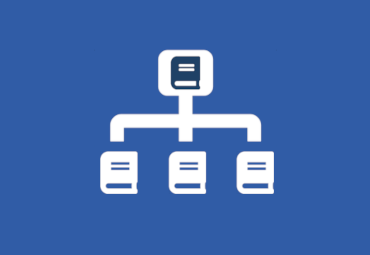

# Bib-Hierarchy Alma Cloud App

An [ExLibris Alma CloudApp](https://developers.exlibrisgroup.com/cloudapps/), which allows to display bibliographic hierarchies in Alma. This App is heavily inspired by https://github.com/gabriele-h/bib-hierarchy.
 
 

## How to use
* Search for any Bib-Record in Alma
* Open the Bib-Hierarchy Cloud App
* Click 'Show hierarchy' on the entry you're intrested in
* Wait(, wait a bit longer)
* See all related records
* Click 'Expand View' to see a nice table, or click export to download the result as Excel file

## How does it work
The result data is retrieved via SRU, this means SRU must be enabled, otherwise this app will not work ([how to enable SRU](https://knowledge.exlibrisgroup.com/Alma/Product_Documentation/010Alma_Online_Help_(English)/090Integrations_with_External_Systems/030Resource_Management/190SRU_SRW_Search#)).

1. Find the NZ MMS ID via Alma API
2. Get the record via SRU
3. Parse out 'other system numbers' from field 035$a
4. Query SRU for 'other_system_numbers' with the result from the previous step
5. Parse the result and display as nice table

## Which fields are used
To display the result table, the following fields are used. If this does not work for you, please open an issue on Github.

* Order: 800$v, 810$v, 830$v, 773$q
* Title: 245
* Year: 008 (substring 7,11)
* Edition: 250
* MMS ID: 001 (controllfield)
* Duplicate: records with the same order and edition are marked as duplicates
* Holding: 852$a

